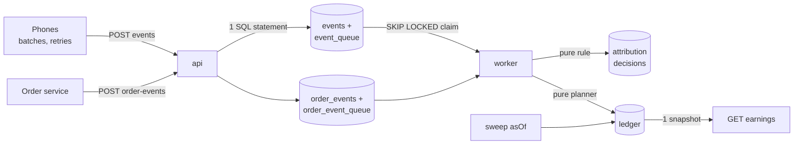

# Aumbram Backend 3: Project Explained

2026-09-22 · Aditya Singh

## What was asked

Aumbram asked for a production-shaped backend that pays creators the right commission for sales their stories drive. The pipeline is **events → attribution → commission ledger**, plus a written design for **10M daily users and 500M events/day**. It is an Experienced-level take-home with an 8–10 hour budget.

**The problem behind it.** A creator's screen said ₹3,120 while her own spreadsheet said about ₹4,000. Three things caused the gap:

- Offline phones uploaded events a day late and they were ignored.
- A retried upload was counted twice.
- Returned orders were paid out and netted off later.

Commission is money owed to a real person, so it must be explainable line by line and never double-counted.

**The four parts.**

| Part | What it must do |
| --- | --- |
| A. Ingestion | `POST /v1/events/batch`: validate 1–500 events, fix phone clocks, reply 202 only when data is durably stored, dedupe exactly, push back with 429/503 when overloaded. Sustain 2,000 events/s with p95 under 200 ms |
| B. Attribution | Decide which story (and so which creator) earns each order, re-decide when late events arrive, keep every version, lock once commission is payable |
| C. Ledger | Double-entry, append-only ledger in Postgres: accrue on delivery, payable after 7 days without a return, reverse on return or re-attribution, earnings from one consistent snapshot |
| D. Design doc | Scale model, architecture at scale, storage tiers, backfill, delivery semantics, observability, failure modes, trade-offs |

**The attribution rule, in plain words.** An order belongs to the last story the user engaged with before checkout, within 72 hours, for a product in that order.

- "Engaged" means watched for at least 3 seconds, or tapped the product in the story.
- "Before checkout" is measured from the user's last checkout in the hour before the order was created, or from the order time if there was none.
- Ties go to the later server receive time, then to the larger event id.
- Commission is `floor(subtotal × rate ÷ 10000)` in integer paise, with the creator's rate snapshotted at first attribution.

**How it is graded.** Two reviewers score it 1–4 on weighted criteria:

- Architecture 20%, correctness 15%, testing 15%.
- Functionality, performance, security and communication 10% each.
- Code quality and operability 5% each.

It must run from the README in 10 minutes and cover at least 80% of the must-haves. Red flags include float money, committed secrets, and claims about features that don't exist.

## The solution at a glance

I built it in **TypeScript on Node 22**, with **PostgreSQL 16 as both the database and the queue**. That makes every "accept an event" and "apply its effect" a single database transaction. All must-haves are built. The one partial is the latency target, which the laptop misses because of host memory pressure (explained under Performance).

| Item | Choice | Why (short) |
| --- | --- | --- |
| Language | TypeScript 5.9, strict, Node 22 | Same runtime as the provided data generator; the workload is I/O-bound; good property-testing library |
| HTTP | Fastify 5 | Fast, body-size limits, safe JSON parsing |
| Storage and queue | Postgres 16 only | 202 = committed; exact dedupe by primary key; queue claim and effects in one transaction |
| Data access | Raw SQL with `pg`, no ORM | Locks, constraints and triggers stay visible and reviewable |
| Tests | Vitest + fast-check against real Postgres | Required by the brief; property tests find boundary and ordering bugs |
| Packaging | docker-compose: postgres, setup, api, worker (+ demo, test, loadtest tools) | Runs from a clean machine with two commands |

**Headline results.**

- 98 automated tests pass, covering all 7 acceptance scenarios (AC-1 to AC-7).
- The load test sustained **1,981 new events/s for 150 s**. All 297,209 accepted events were stored and processed, and the queue drained 1.1 s after load stopped.
- A chaos run killed the worker and the API with `kill -9` mid-load. None of the 88,164 events that got a 202 were lost.
- Latency: p50 21 ms, and 95.7% of batches under 200 ms server-side. Client p95 was 241 ms and p99 1.6 s, so the latency target is **not fully met** on this laptop.
- 44 decisions are logged in `DECISIONS.md`, each with its reason.
- The code is on a private GitHub repo with an open PR.

## Architecture

Two Node processes share one Postgres. The **api** accepts and stores. The **worker** does the thinking: it indexes interactions, attributes orders and posts to the ledger.



Read it left to right. Every write lands in Postgres before the API answers, and the worker turns stored events into decisions and ledger entries.

**Processes.**

| Process | Runs | Scales by |
| --- | --- | --- |
| api (port 8080) | ingestion, order-event intake, reads, sweep endpoint, `/health`, `/metrics` | more api containers |
| worker (port 9091) | 2 event consumers, 2 order consumers, invariant checker every 60 s, optional scheduled sweep | `--scale worker=N` (safe thanks to row and advisory locks) |
| setup (one-shot) | applies migrations, seeds creators, products and stories from the generator | n/a |
| Postgres 16 | all data, both queues | vertical; the at-scale plan moves ingest to Kafka |

**Main tables.**

| Table | Holds | Key rule |
| --- | --- | --- |
| `events` | every raw event | primary key = normalised event id (the dedupe) |
| `event_queue` | work for the event consumer | deleted in the same transaction as its effects |
| `interactions`, `checkouts` | the ~5% of events the rule reads | indexed by (user, serverTs) |
| `orders` | one row per order + what the ledger holds for it | status times recorded, first snapshot wins |
| `attribution_decisions` | every version of every decision | append-only (trigger) |
| `late_locked_events` | late events that would have changed a locked order | audit only |
| `ledger_accounts`, `ledger_transactions`, `ledger_entries` | the money | append-only; each transaction sums to 0 (checked at commit) |

## Part A: Ingestion

A batch is accepted in one database statement, so a 202 always means "committed". It survives `kill -9` of the API process, and repeats of the same event are absorbed exactly.

**What happens to a batch.**

1. **Auth first.** `X-App-Key` is checked before the body is even read, so strangers can't make us parse 1 MB. Keys are compared in constant time.
2. **Size limits.** Over 1 MB → 413. Gzip is decompressed with a running byte count, so a 20 KB "zip bomb" that expands to 20 MB is stopped at 1 MB. Fewer than 1 or more than 500 events → 422.
3. **Backpressure.**
    - If the queue is deeper than 200,000 or its oldest item is older than 60 s → **503** with `Retry-After`.
    - If this client (by IP) has used its budget (10,000 events/s, counted in events not requests) → **429** with `Retry-After`.
4. **Validate each event on its own.** Bad events go into `rejected: [{index, id, code, message}]` and the good ones are still stored (partial acceptance). Checks cover the id format, the 7 event names, required props per name, timestamps, and hostile input such as the NUL character.
5. **Fix the phone clock.** `serverTs = min(receivedAt, clientTs + (receivedAt − sentAt))`. One batch shares one phone clock, so this cancels skew. Example: a phone 5.5 h fast reports 14:04:31, and we store 08:34:34.
6. **Store in one statement.** Insert into `events` sorted by id with `ON CONFLICT DO NOTHING`, and put the newly inserted ids on `event_queue`. Sorting by id means two identical concurrent batches can't deadlock.
7. **Reply 202** with `accepted` (newly stored), `duplicates` (already known) and `rejected`; these always add up to the batch size.

**Dedupe.** `evt_<uuid>` and `<uuid>` are the same event: the id is lower-cased and the prefix stripped before it becomes the primary key. Acceptance test AC-1 sends a 100-event batch containing 2 internal duplicates, three times at once. Exactly 98 events are stored and processed.

**Why Postgres and not Kafka or Redis for the queue.** A Postgres queue lets the worker claim a message and write its effects in the same transaction. That gives exactly-once effects with no cross-system coordination. Redis Streams would add a second durability question (its disk-sync setting decides whether a 202 is honest) and still need Postgres for dedupe. Kafka is the right tool at 500M/day and is in the scale design.

## Part B: Attribution

The rule is one **pure function**, `attribute()` in `src/attribution/rule.ts`. It takes the order, the user's checkouts and interactions, and the story lookup, and returns the winner. No database or clock is involved, so it is easy to test and to change live in the review call.

**What the function does.**

1. **Anchor:** the user's latest `checkout_start` in the hour before the order was created, otherwise the order's creation time.
2. **Window:** keep interactions with `anchor − 72 h ≤ serverTs ≤ anchor` (both ends included).
3. **Qualify:** same logged-in user, and either a view of at least 3,000 ms of a story that tags a product in the order, or a tap on a product that is in the order. Unknown stories or products never match.
4. **Winner:** greatest `serverTs`, then greatest `receivedAt`, then greatest event id.
5. **Creator:** always from the story record, **never** from the `creatorId` the phone sends.

**When it runs.**

- **New order.** On the first message for an order, whatever its status (statuses can arrive out of order), the order is created and attribution version 1 is written.
- **New event.** When the event consumer indexes a view, tap or checkout, it finds the user's orders that event could affect and re-runs the rule for each.
- **Re-attribution job.** `cli reattribute --from --to` re-runs orders in a date range, for bug fixes or rule changes.

**Versioned, never overwritten.** Each change of outcome writes version N+1 to `attribution_decisions`, which a trigger makes append-only. A new version is written only if the winner, the anchor or attributed/not changed. Each version records the reason (`initial`, `late_event`, `reattribution_job`), the event that triggered it and the rule version (`v1`).

**Locking.** Once commission is payable (7 days after delivery with no return request), the attribution is locked. A later event that would have changed it is written to `late_locked_events` for audit and changes nothing. Returned or cancelled orders lock too, since no money is at stake.

**Rate snapshot.** The creator's commission rate is taken from the order's first decision naming that creator. If a creator's rate changes and the order later swings back to them, the old rate still applies.

**Example (AC-2 and AC-3).** One checkout produced two orders from two vendors.

- The kurta order is attributed to a 4.2 s view from 50 hours earlier. A tap 10 h earlier was on another vendor's product, and a view 1 h earlier lasted only 1.5 s.
- The other vendor's order goes to that tap.
- Later an offline phone uploads a tap from 2 h before checkout. The kurta order moves to version 2 with the new creator, and on delivery only the new creator accrues.

## Part C: The commission ledger

Money lives in a **double-entry, append-only ledger** whose rules the database itself enforces. Every change is driven by one **pure planner** that compares what the ledger holds for an order with what it should hold.

**Accounts and entries.** There is one platform `commission_expense` account, and each creator has an `accrued` and a `payable` account. Debits are positive, credits negative, and every ledger transaction sums to exactly 0.

| Business event | Entries (amount A in paise) |
| --- | --- |
| Accrue (order delivered, attributed) | expense +A, creator accrued −A |
| Make payable (sweep, 7 days, no return) | creator accrued +A, creator payable −A |
| Reverse (returned, or moved to another creator) | creator accrued or payable +A, expense −A |

**Guarantees enforced by Postgres, not by trust in the code.**

- Triggers reject any UPDATE, DELETE or TRUNCATE of ledger rows. Corrections are always new, compensating entries.
- A constraint checked at COMMIT rejects any ledger transaction whose entries don't sum to 0, or that has fewer than 2 entries.
- Each effect has a UNIQUE key such as `accrue:ord_A:v2`, so the same effect for the same order and version can never post twice.
- Amounts are `BIGINT` paise and `bigint` in TypeScript. Floats are never used. For example, 99,999 paise at 700 bps gives 6,999.

**The planner: `planPostings(held, desired)`** in `src/ledger/plan.ts`.

- *Desired* comes from the order's state and current decision:
    - not delivered, returned, cancelled or unattributed → nothing;
    - swept → payable;
    - otherwise → accrued.
- *Held* is stored on the order row.
- The planner returns exactly the transactions needed to get from held to desired.

Because effects come from **state**, not from the order of messages, duplicates and out-of-order statuses converge on the same ledger. For example, `returned` arriving before `delivered` never accrues. AC-4 shows the full path: creator X accrues, a late event arrives, X reverses and Y accrues, the total stays 0 and X's balance returns to where it was.

**Sweep.** `POST /v1/internal/jobs/commission-sweep {asOf}` takes an injectable clock. It makes orders payable where `deliveredAt + 7 days ≤ asOf` and no return was requested, then locks them. It uses one transaction per order, so it can be re-run safely. AC-6 checks that an order whose return is requested 6 days 23 hours after delivery is never paid, even with a daily sweep, and that a `returned` message sent 3 times reverses exactly once.

**Earnings.** `GET /v1/creators/{id}/earnings` reads accrued, payable, reversed and lifetime totals plus order counts inside one `REPEATABLE READ` read-only transaction, so a poll never sees half a transaction. AC-7 polls continuously while 4 workers apply 200 orders' delivery messages (each sent twice). Every poll satisfies accrued = orders × commission. A cursor-paginated `/ledger` endpoint lets a creator reconcile line by line.

## Correctness under concurrency and failure

Each business effect happens **at most once per order**, and every accepted event's effect happens **exactly once**. This holds with duplicates, out-of-order messages, several workers and crashes.

| Hop | Guarantee | Mechanism |
| --- | --- | --- |
| Phone → API | at-least-once (phones retry) | duplicates absorbed by the event-id primary key |
| API → storage | exactly-once storage | one statement inserts the event and its queue row; 202 only after commit |
| Queue → worker | exactly-once effects | the claim (`DELETE … FOR UPDATE SKIP LOCKED`) and all effects commit in one transaction; a crash rolls both back |
| Order service → API | at-least-once, any order | `(orderId, status)` primary key; effects derived from state |
| Decision → ledger | at most once per effect | order row lock + unique idempotency key + zero-sum check at commit |
| Ledger → earnings | never torn | one `REPEATABLE READ` snapshot |

**The race that needed a lock.** The event consumer and the order consumer could run at the same moment for the same user:

- the event consumer stores a new tap but can't yet see the uncommitted new order;
- the order consumer creates the order but can't yet see the uncommitted tap.

The order would stay wrongly attributed. Both consumers therefore take a **per-user advisory lock** first, so whichever goes second sees the first one's data. Locks are always taken in the same order (users sorted, then orders sorted), so they can't deadlock. Deadlocks and serialisation failures are retried automatically anyway.

**Poison messages.** If a batch fails for a non-transient reason, the worker retries the events one at a time. The one that still fails moves to a dead-letter table, so a single bad row never blocks the pipeline.

**Crash test.** During a 2,000 events/s load run the worker was killed with `kill -9`, then the API. Both restarted, and all 88,164 events that had received a 202 were stored and processed, none left queued.

**Invariant checker.** Every 60 s the worker verifies four things:

- the total of all entries is 0;
- every transaction balances;
- no creator balance is negative;
- each order's recorded position matches its entries.

It records the result and logs `LEDGER_INVARIANT_VIOLATION` on failure.

## Testing

**98 tests pass**, both on the host (`npm test`) and in Docker (`docker compose run --rm test`). Everything except the pure unit tests runs against a real Postgres.

| Suite | What it proves |
| --- | --- |
| Rule unit tests (23) | Every edge case the brief lists: exactly 72 h counts and 72 h + 1 s doesn't; watchMs 2999 vs 3000; a story tagging only another product; a tap in the sibling order of the same checkout; ties; logged-out users; unknown stories; the anchor fallback; the skewed-clock example |
| Rule properties | Input order never changes the winner; the winner is the latest qualifying event; adding non-qualifying noise changes nothing |
| Ledger planner | Table of every held → desired case, plus a property: postings always land exactly on the desired position and re-planning is a no-op |
| Ingestion | AC-1 (98 of 100 under 3 concurrent sends), partial acceptance, `evt_` prefix, stored `serverTs`, NUL rejection, 413/422/400/415, gzip and zip bomb, key separation, 429 and 503 with recovery |
| Scenarios | AC-2 to AC-7 end to end through HTTP and the real consumers, plus out-of-order statuses, an anchor shift that un-attributes, the rate snapshot and ledger paging |
| Ledger properties | Random, duplicated, shuffled order-event sequences with 1–4 concurrent workers: sum = 0, per-order net is 0 or exactly the expected commission, no negative balances, earnings = sum of entries, and replay gives an identical ledger |
| Tools | Backfill trusts `server_ts` and is idempotent; re-attribution over a range is idempotent |

**Do the tests catch real bugs?** I broke the code on purpose twice.

- Deleting the reversal step from the planner made the property test fail, and it shrank the failure to a minimal example: one returned order.
- Making the 72-hour boundary exclusive failed the boundary test.

The code was restored both times.

## Performance

Throughput, correctness, lag and durability pass. **Latency passes at p95 server-side but fails at p99.** The tail comes from the Windows host paging the Docker VM, not from the code, and I did not weaken durability to hide it.

**Official run: 2,000 events/s for 150 s on a fresh stack**, i7-7700HQ laptop with 8 GB RAM, Docker Desktop.

| Target | Result | Status |
| --- | --- | --- |
| ≥ 2,000 events/s for ≥ 120 s | 1,981/s newly stored (the rest were the data's own duplicates) | pass |
| p95 < 200 ms | 95.7% of batches < 200 ms server-side; client p95 241 ms | partial |
| p99 < 500 ms | client p99 1,570 ms | fail |
| Queue back to ~0 within 60 s | 1.1 s after load stopped | pass |
| Event → processed p95 < 5 s | ≤ 0.5 s | pass |
| Every accepted id processed | 297,209 = 297,209 | pass |
| No 5xx | 3,001 × 202, zero errors | pass |

**How the bottleneck was found.**

1. Without stalls a batch is cheap. The SQL takes ~10 ms (`EXPLAIN ANALYZE`) and the disk flush ~4 ms (`pg_test_fsync`), about 35 ms end to end inside Docker.
2. Sampling what Postgres waited on showed ~55% of ingest time is the durable commit (WAL flush). That is the price of "202 = committed".
3. The first run's 1-second stalls lined up with a checkpoint. Tuning checkpoints (`max_wal_size=4GB`, `checkpoint_timeout=15min`) removed them and all 503s.
4. Windows port forwarding added 30–40 ms per request, so the load generator now runs inside the Docker network.
5. The remaining 1-second stalls hit unrelated statements at the same instant, even a pure planning step. The host had 0.3 GB free RAM and was paging 4,600–17,000 pages/s, so Windows was freezing the whole VM.

**Rejected fixes.**

- Making the worker commit in bigger batches did not help, so it was reverted.
- Turning off `fsync` or `synchronous_commit` would meet any target but break durability, so it was never an option.

All 8 runs, including one invalid run (it replayed already-stored ids, so nothing was written), are in `docs/loadtest.md`.

## Part D: Scaling to 10M daily users

At 500M events/day the heavy work is **ingesting and storing raw events**. Attribution and money stay small, because only ~5% of events matter to the rule and orders arrive at ~18/s. The full design is in `docs/design.md`.

| Quantity | Number |
| --- | --- |
| Average / daily peak / Diwali peak | 5,800 / 17,400 / 52,000 events/s |
| Raw data | 200 GB/day (~6 TB/month); ~17 GB/day compressed as Parquet |
| Events the rule reads | ~27M/day (5.4%, measured on the mock data mix) |
| Orders / ledger | ~260k orders/day; ~170k ledger transactions/day |
| Ingest pods | ~15 (5k events/s per 1-vCPU pod, N+2 across 3 zones) |
| Log partitions | 64, keyed by `userId` |

**What changes from the laptop.**

- **Kafka replaces the Postgres queue.** Keying by `userId` puts all of a user's events and orders on one partition. One consumer then owns each user, which replaces the per-user lock.
- **Dedupe becomes tiered.** Money-relevant events stay exactly deduped by key forever. Raw events are deduped for 7 days in per-partition storage, and older duplicates are removed by a daily compaction job.
- **Interaction index:** Postgres sharded by user, partitioned by day, 30 days hot.
- **Ledger:** its own Postgres cluster, fed through a transactional outbox, with monthly partitions and daily balance checkpoints so a viral creator's earnings stay fast.
- **Retention:** the ledger and decisions are kept 8 years (tax and audit). Raw behaviour data is kept only as long as needed, with pseudonymised ids, as India's DPDP Act 2023 requires.
- **Rule changes** (for example 72 h → 48 h) go through versioning, then a shadow run and diff, then re-attribution of provisional orders only. Locked commission is never clawed back silently.

The design doc also covers SLOs, dashboards, alert thresholds, a 12-row failure-mode table and a support runbook for "why is my commission ₹X?".

## Key decisions, interpretations and gaps

All 44 decisions, each with its reason and the alternatives considered, are in `DECISIONS.md`. The ones a reviewer is most likely to probe:

| # | Decision | Reason |
| --- | --- | --- |
| D-003 | Postgres is also the queue | Claim and effects in one transaction give exactly-once effects |
| D-017 | Per-user advisory locks | Prevents the race where neither consumer sees the other's new row |
| D-018 | Ledger driven by "desired vs held" state | Duplicates and out-of-order messages converge |
| D-019 | Unique key per effect and version | At most one effect per order, enforced by the database |
| D-020 | Attribute on the first message of any status | `delivered` can arrive before `created` |
| D-021 | Also lock returned, cancelled and unattributed-after-7-days orders | Stops months-late events changing settled orders |
| D-022 | `returned` after payable claws back from payable | The spec only says "reverse on returned" |
| D-023 | A tap counts even if the story doesn't tag that product | The spec's table says so; I'd tighten it (see below) |
| D-041 | Tune checkpoints, never turn durability off | Keeps "202 = committed" honest |

**Where I disagree with the spec** (implemented as written, argued in the design doc):

- A tap should only count if the story actually tags the tapped product; otherwise a modified app can claim any story.
- The phone should send a monotonic uptime timestamp so clock changes mid-batch can't skew `serverTs`.

**Not built, and said so openly.**

| Item | Status | Why / next step |
| --- | --- | --- |
| Latency p99 on this laptop | partial | Host memory pressure; re-measure on Linux or a machine with more RAM |
| Session stitching (BE-E-22) | not done | Linking anonymous browsing to a login is a DPDP consent question first |
| Payouts (BE-E-23) | not done | Needs a "receivable" for clawbacks after money has been paid out |
| Partitioned consumers (BE-E-24) | partial | Several workers are safe via locks; partitioning is the Kafka design |

## Running it, repo map and review-call prep

Two commands start everything and show the whole story; only Docker is needed.

```bash
docker compose up -d --build     # postgres, migrate + seed, api :8080, worker :9091
docker compose run --rm demo     # end-to-end demo
docker compose run --rm test     # 98 tests
```

The demo prints each step. A phone with a clock 5.5 h fast sends a batch with a duplicate and a spoofed creator. An order is attributed. A late offline tap re-attributes it (X accrues, reverses, Y accrues). A second order is returned. The sweep makes the first order payable. Finally it shows the ledger lines and both creators' earnings.

**Where things live.**

| Path | What |
| --- | --- |
| `src/attribution/rule.ts` | the pure attribution rule |
| `src/ledger/plan.ts` | the pure ledger planner |
| `src/ingest/` | validation, `serverTs`, one-statement store, rate limiter, queue monitor |
| `src/consumers/` | event and order consumers |
| `src/orders/` | order intake, processing, sweep, locks |
| `migrations/001_init.sql` | schema, append-only triggers, zero-sum check |
| `test/` | unit, integration and property tests |
| `docs/` | `design.md`, `loadtest.md`, raw load-test JSON |
| `DECISIONS.md` | the 44 decisions |
| GitHub | private repo `uniqueb0y/aumbram-backend-experienced`, PR #1 |