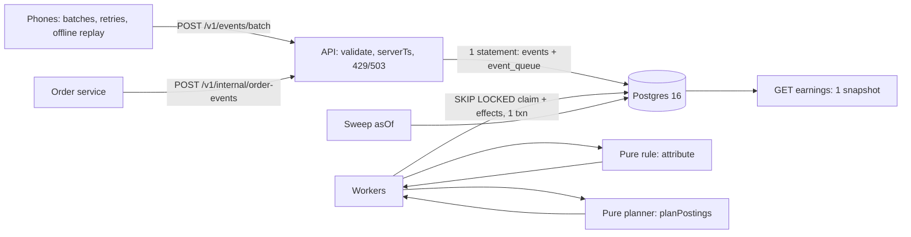

# Design: events → attribution → commission ledger at 10M DAU

This document covers how the laptop system in this repository becomes a system for **10M daily active users and 500M events/day**. Every non-trivial choice links to [DECISIONS.md](../DECISIONS.md) (`D-xxx`). Measured laptop numbers come from [loadtest.md](loadtest.md).

**The laptop version in one paragraph.** A Fastify API validates each batch, derives `serverTs`, and inserts events and queue rows in one Postgres statement, so a 202 means the data is committed. Workers claim queue rows with `SKIP LOCKED`. They index the few events the rule cares about (story views, product taps, checkouts), then re-run a pure attribution function for the orders a new event could affect. Every change is a new decision version. The ledger is double-entry and append-only; Postgres enforces Σ = 0, immutability and one-effect-per-order-per-version. The ledger is driven by a pure planner that moves "what the ledger holds for this order" to "what it should hold".

---

## 1. Scale model

| Quantity | Working | Result |
|---|---|---|
| Events per day | given | **500M** |
| Average rate | 500M ÷ 86,400 s | **5,800 ev/s** |
| Daily peak factor | Indian traffic concentrates 19:00–23:00 IST; assume peak hour = 3× average | **17,400 ev/s** |
| Festive (Diwali) day | assume 3× daily volume, same shape | 1.5B events/day, peak **52,000 ev/s** |
| Burst design point | offline replay after a regional network outage lands on top of the festive peak | ingest sized for **60k ev/s**; above that, shed with 503 + `Retry-After` |
| Bytes per event | ~400 B JSON (the generator's CSV averages 229 B, so this is conservative) | |
| Raw volume | 500M × 400 B | **200 GB/day, ~6 TB/month** (festive day 600 GB) |
| On the wire | gzip on 25-event batches ≈ 6× | ~33 GB/day ingress; peak ≈ 1.2 MB/s (festive 3.5 MB/s) |
| At rest | Parquet + zstd ≈ 12× | **~17 GB/day, ~0.5 TB/month** |
| HTTP requests | SDK flushes every 25 events or 30 s | avg 230 req/s, peak 700, festive 2,100 |
| Events the rule cares about | measured on the generator mix: story_view 4.5%, story_product_tap 1.2%, checkout_start 0.6%; ~85% logged in | **~5.4% → ~27M rows/day** into the interaction index |
| Orders | 10M DAU × ~2% conversion × 1.3 vendors per checkout | ~260k orders/day; ~6 status messages each = 1.6M order events/day (**~18/s**) |
| Ledger | ~30% attributed × ~2.2 transactions per order | ~170k transactions/day, ~340k entries/day (**~125M entries/year**) |

**Sizing.**
- **Ingestion instances.** On this laptop one Node process ingests 2,500 ev/s at under 15% of a core, so the CPU is not the limit. Budget **5k ev/s per 1-vCPU pod at ≤ 50% CPU**, which leaves room for gzip and TLS. Festive peak 52k → 11 pods; with N+2 per zone across 3 zones, **15 pods**, autoscaled between 6 and 24.
- **Log partitions.** Target ≤ 3k ev/s per partition-consumer, including dedupe lookups. 52k / 3k ≈ 18, so use **64 partitions** (keyed topics are painful to repartition, so over-provision once). 3 brokers, RF = 3, 7-day retention ≈ 200 GB × 7 × 3 / 6 (compression) ≈ **0.7 TB** of broker disk.
- **Consumers.** Raw-sink: 64 (one per partition, writing Parquet every 5 min). Attribution indexers: 16 are plenty. They see only 5.4% of traffic, ~2.8k ev/s at festive peak.
- **Money path.** Orders at ~18/s and ledger at ~170k transactions/day are small. One Postgres primary with a synchronous standby handles this for years. The heavy part of the system is ingestion and raw storage, not attribution or money.

---

## 2. Architecture at scale

| Concern | Laptop (this repo) | At 10M DAU | Why the change |
|---|---|---|---|
| Ingestion tier | 1 Fastify process | Stateless pods behind an L7 LB; gzip; per-client limits in the edge proxy (Envoy global rate limit), not in-process (D-008) | Horizontal scale; a limit that is consistent across pods |
| Durable accept | Postgres commit (D-003) | Kafka/Redpanda produce with `acks=all`, `min.insync.replicas=2`, idempotent producer. 202 only after the ack | Postgres can't absorb 52k ev/s of raw writes cheaply; a log can, and it replays |
| Queue / log | `event_queue` table + `SKIP LOCKED` | Topic `events.v1`, **64 partitions keyed by `userId`** (`sessionId` for logged-out users); topic `order-events.v1` also keyed by `userId` | All of a user's interactions and orders land on one partition. One consumer then owns a user, so the per-user advisory lock (D-017) becomes partition ownership: no cross-node locking and no write skew |
| Dedupe | PK on `events.id`, exact forever | **Tiered.** (1) Money path: exact, via the PK of the interaction index (27M rows/day) and ledger idempotency keys. (2) Raw path: per-partition RocksDB state with a 7-day TTL (3.5B ids × ~40 B ≈ 140 GB total, ~2.2 GB per partition on local SSD). Duplicates older than 7 days are removed by the daily lake compaction (`MERGE` on `event_id`) | Exact dedupe of every raw event forever is not worth its cost. Exactness only matters where money depends on it |
| Interaction index | `interactions (user_id, server_ts)` | Postgres **sharded by `user_id`** (Citus or app-level, 8 shards), partitioned by day, **30-day retention** (~27M rows/day × ~150 B ≈ 4 GB/day, 120 GB hot) | The rule's access pattern is "one user, a 73 h window", a single-shard range scan. Day partitions make retention a `DROP` |
| Attribution decisions | same DB, append-only | Co-located with the interaction shard of the same user. Ledger commands go out through a **transactional outbox** | A re-attribution is then a single-shard transaction; the ledger stays a separate cluster |
| Ledger | same DB | Dedicated Postgres cluster, `ledger_entries` **partitioned by month**, consumer of the outbox, idempotency keys unchanged (D-019) | Separate blast radius and access control; financial retention differs |
| Hot creator | no hot row: entries are append-only, balances are sums (D-006) | Add **daily balance checkpoints** per account (`balance as of txn id N` + delta since) so earnings stay O(1) for a viral creator | A 1M-entry creator would make "sum all entries" slow; a checkpoint keeps the read bounded |

**Freshness SLO at scale:** event-to-attribution re-evaluation **p95 < 60 s** (laptop measured p95 ≤ 0.5–5 s).

---

## 3. Storage tiering

| Data | Hot | Warm | Cold | Must keep long-term? | Cost drivers |
|---|---|---|---|---|---|
| **Raw events** | Kafka 7 days (replay buffer); sharded OLTP not used for raw | Lake: Parquet + zstd on object storage, partitioned by day/hour, **90 days**, queried by ClickHouse/Trino | Archive tier, **13 months** (year-over-year festive comparison), then aggregated and deleted | No. Behavioural personal data; keep only as long as the purpose needs (DPDP) | Broker disk × RF; object-storage GB-month; scan bytes |
| **Interaction index** | Sharded Postgres, **30 days** (72 h window + late arrivals + reprocessing headroom) | none, rebuilt from the lake if needed | none | No | SSD GB; index size; write IOPS |
| **Attribution decisions** | OLTP, **13 months** (returns, disputes, support) | Parquet export, queryable | Archive, **8 years** | **Yes.** They explain every rupee paid | Small: ~260k orders/day × a few versions |
| **Ledger** | OLTP, current + previous financial year online | Older monthly partitions detached to cheaper storage, still queryable | Archive, **8 years**, immutable (WORM bucket) | **Yes.** Books of account and TDS on commission (Income Tax Act §194H; books kept at least 6 years from the end of the assessment year; GST records 72 months). 8 years covers both | Tiny volume; the cost is in backups and PITR |

**DPDP Act 2023 (user-level events).**
- `userId`, session and device events are personal data about behaviour.
- **Notice and consent:** attribution for creator payouts and analytics must be named purposes in the consent notice.
- **Purpose limitation and minimisation:** the lake stores a salted hash of `userId` (key held by the platform, rotated yearly). Raw ids exist only in the 30-day hot tier.
- **Erasure on withdrawal:** delete from hot stores, and crypto-shred the lake by deleting the per-user salt/key. Ledger rows hold only order and creator ids, and are retained under the legal-obligation exemption.
- **Children:** no behavioural tracking of users under 18 without verifiable parental consent. The SDK must not emit interaction events for such accounts.
- **Breach notification** to the Data Protection Board and to affected users.
- **Logs** never contain phone numbers or addresses (D-038; `redactPaths` in `src/lib/logger.ts`).

---

## 4. Reprocessing and backfill

**Scenario: rule change 72 h → 48 h, applied to the last 30 days.**
1. **Version the rule, don't edit it.** Add `v2 = {windowMs: 48h, …}` in `ruleConfig.ts` (D-030). Every decision records `rule_version`.
2. **Shadow run.** A job evaluates v2 for the 30 days of orders into a shadow table without touching decisions or the ledger. It produces a diff report: orders that change creator, money moved per creator, and locked orders that would change. Finance and creator-ops sign off.
3. **Apply to provisional orders only.** `cli reattribute --from --to` with `ATTRIBUTION_RULE_VERSION=v2` (already implemented, `src/tools/reattribute.ts`). A changed outcome writes version N+1. The ledger is reconciled by the same planner, reversing the old creator's accrual and accruing the new one, with idempotency keys `reverse:<order>:vN` / `accrue:<order>:vN+1`. Re-running the job is a no-op.
4. **Never silently claw back locked commission.** For orders already payable, the job only records a `late_locked_events` row with the would-be creator. If the business decides money must move (for example, a proven bug paid the wrong creator), that is an explicit, approved `adjustment` ledger transaction with creator notification. Not built; listed in §8.
5. **Don't overload production.** The job runs as a separate low-priority worker. It processes `created_at` ranges in id order (resumable), throttles to N orders/s, and pauses automatically when ingest p95, replication lag or queue lag burn their SLO budget. At scale the raw events come from the lake, not from Kafka.
6. **Backfill of historical events** (`cli backfill-events`, D-036/BE-E-21) trusts the CSV's `server_ts`, goes through the same consumer path (so it re-evaluates provisional orders), and at scale uses its own topic, so live traffic keeps priority.

---

## 5. Delivery semantics

| Hop | Guarantee | Mechanism (laptop) | At scale | Where duplicates or loss can occur |
|---|---|---|---|---|
| Phone → API | at-least-once | SDK retries the same batch on timeout/429/503 | same | Duplicates only. They are absorbed at the next hop |
| API → durable store | **exactly-once storage** | Events + queue rows in **one statement**; PK `ON CONFLICT DO NOTHING`; rows sorted by id so concurrent identical batches can't deadlock (D-026). 202 only after commit | Kafka idempotent producer, `acks=all`, 202 after ack | Loss: none after a 202. A crash after commit but before the response makes the client retry, which counts as a duplicate |
| Queue → event consumer | **effectively-once effects** | The claim (`DELETE … SKIP LOCKED`) and all effects commit in **the same transaction** (D-003). A crash rolls both back | At-least-once from Kafka. Offsets are committed **after** the DB transaction; effects are idempotent (interaction PK, decision `(order, version)` PK, ledger idempotency key) | At scale: after a crash between DB commit and offset commit, a batch is reprocessed and every write is a no-op |
| Order service → API | at-least-once, any order | PK `(orderId, status)` dedupes intake; processing derives effects from **state**, not transitions (D-018) | same, `order-events` topic | Out-of-order messages are fine: `returned` before `delivered` never accrues |
| Attribution → ledger | **at most once per effect** | Order row lock + UNIQUE `idempotency_key` + deferred Σ=0 constraint (D-006, D-019) | Outbox row in the user shard → ledger consumer with the same keys | None. A repeated effect is rejected by the unique key |
| Ledger → earnings read | consistent snapshot | `REPEATABLE READ READ ONLY` (D-006) | same, from a replica (with an `asOf` lag) | Reads can be seconds stale on a replica, but never torn |

**Known windows (business-level, not duplication).**
- An event still waiting in the queue isn't in the index yet, so an order created in that gap is provisionally attributed without it. Re-evaluation fixes it when the event is consumed; the gap is bounded by queue lag.
- A `return_requested` that reaches us *after* the sweep has made the order payable doesn't undo payability (D-022). A later `returned` claws back from payable.

---

## 6. Observability

**SLIs and SLOs** (30-day windows).

| SLI | SLO | Laptop measurement |
|---|---|---|
| Ingest availability: batches answered 2xx/4xx, excluding intentional 503 shedding | 99.9% | 100% (no 5xx in any run) |
| Ingest latency, 100-event batch | p95 < 200 ms, p99 < 500 ms | official run (2,000 ev/s): p50 21 ms; server-side 95.7% < 200 ms; client p95 241 ms, p99 1.6 s. The tail comes from host memory pressure (D-044) |
| Shed rate (503 + 429) | < 1% of batches outside incidents | 0% at 2,500 ev/s |
| Event → attribution re-evaluation | p95 < 60 s at scale | p95 ≤ 0.5–5 s |
| Queue lag (oldest item age) | < 30 s p99 | drained within 2 s of load stopping |
| **Ledger invariant violations** | **0** (any violation pages) | 0; checked every 60 s by the worker |

**Dashboards.**
1. **Ingest:** rate by outcome (`ingest_events_total`), rejects by code, duplicate ratio, 429/503 rates, latency heatmap.
2. **Pipeline:** `queue_depth`, `queue_oldest_age_seconds`, consumer throughput, batch duration, dead letters.
3. **Attribution:** evaluations by trigger and outcome, re-attributions (`db_attribution_reevaluations_changed`), late-locked rate.
4. **Money:** ledger transactions by type, accrued and payable totals, `db_ledger_invariants_ok`.
5. **Postgres:** connections, lock waits, WAL fsync time, replication lag, checkpoint duration.

**Alerts.**

| Alert | Threshold | Severity |
|---|---|---|
| Ledger invariant violated | `db_ledger_invariants_ok == 0` once | page, and freeze payouts |
| Queue lag | oldest age > 120 s for 5 min | page |
| Ingest 5xx | > 1% for 5 min | page |
| Load shedding | 503 > 5% for 10 min | ticket, page after 30 min |
| Dead letters | > 0 new in 15 min | ticket |
| Duplicate ratio | > 10% of accepted for 15 min | ticket (client bug) |
| Late-locked spike | > 3× the 7-day baseline | ticket (offline replay or clock bug) |

**"Why is my commission ₹X?" (support runbook, single order).**
1. `GET /v1/orders/{orderId}/attribution?history=true` shows every decision version: winning event (id, name, `serverTs`), anchor (checkout or order time), rate snapshot, commission, reason (`initial`, `late_event`, `reattribution_job`), the event that triggered each change, and any late events that arrived after locking.
2. `GET /v1/creators/{creatorId}/ledger` lists the creator's accrue / reverse / make_payable lines for that order, with the attribution version each came from.
3. Look up the winning event by id in `events` to see `clientTs`, `receivedAt` and `serverTs`. This settles "my phone said 10:05" arguments.
4. Logs keyed by `orderId` show when each status arrived. Logs keyed by `batchId` (returned to the client in every 202) show which upload carried an event.

---

## 7. Failure modes

| # | Failure | Detection | Impact | Mitigation | Recovery |
|---|---|---|---|---|---|
| 1 | **Queue broker outage** (Kafka; Postgres on the laptop) | produce errors; `/health` 503; ingest 5xx/503 rate | New events can't be durably accepted | Fail closed: return 503 + `Retry-After`, never 202 without durability. The SDK keeps a disk-backed queue. RF = 3 across AZs | Clients retry with jitter; dedupe absorbs repeats; consumers autoscale for the lag spike |
| 2 | **Consumer crash mid-batch** | worker liveness; `queue_oldest_age_seconds` rising | Freshness only | Laptop: claim + effects in one transaction, so the claim rolls back. Scale: offsets committed after the DB transaction, effects idempotent | Restart. Verified: 3 consumers draining AC-1 concurrently; the D-036 isolation path |
| 3 | **Postgres primary failover** | connection errors; `/health` `db.ok=false` | Ingest 503 (laptop) or consumers pause (scale); in-flight transactions roll back | Synchronous standby, so no committed ledger row is lost. Pool timeout 2 s gives a fast 503 (D-008). The deferred Σ=0 check means a half-written ledger transaction can't commit | Patroni-style failover (~30 s). Workers resume from the queue/offsets. Run `cli check-invariants` after failover |
| 4 | **Poison event** (valid at ingest, crashes a consumer) | `dead_letters_total` > 0 | One event unindexed; the rest of the queue flows | Strict validation at ingest (NUL, types, sizes, D-027). Batch → one-by-one isolation → dead-letter table (D-036) | Fix, then re-enqueue from `event_dead_letters` |
| 5 | **Client bug flooding duplicates** | duplicate ratio metric; per-client 429 rate | Ingest load; no correctness impact (exact dedupe) | Per-client token bucket counted in events (D-029). Dedupe at the PK | Hotfix the SDK; block the app version at the edge |
| 6 | **Massive offline replay after a network outage** (millions of phones reconnect) | ingest rate spike; queue depth; 503 rate | Freshness SLO breach; some 429/503 | Backpressure with `Retry-After` plus SDK jitter. Events with `clientTs` older than 1 h go to a lower-priority replay topic. Autoscale ingest and consumers | Drains. Late events re-evaluate provisional attributions, so money ends up correct; locked orders are audited, not changed |
| 7 | **Clock skew beyond the correction** (device clock changed mid-batch, `sentAt` missing, NTP jump) | share of batches without `sentAt`; `receivedAt − serverTs` outliers; sessions whose `serverTs` goes backwards | Wrong `serverTs`, so attribution can be wrong at window edges | The SDK should send a monotonic elapsed-realtime per event and at send time, making offsets immune to wall-clock changes. Clamp `serverTs ≥ receivedAt − 30 d` | `cli reattribute` over affected users and time range; locked orders are audited, not changed |
| 8 | **Hot creator** (viral story) | per-creator transaction rate; earnings latency | None on writes (append-only, no hot row) | Balance checkpoints (§2); cache earnings for a few seconds | n/a |
| 9 | **Bad rule deploy** (for example a 7.2 h window) | attribution rate by `rule_version` drifts; shadow diff; canary | Provisional attributions flip; locked ones untouched | Rule versioning (D-030), shadow run, canary on a small user percentage, config flag | Revert the rule version and run `reattribute` over the affected range. Re-attribution posts compensating entries |
| 10 | **Sweep job dies midway** | job exit code; `sweep_orders_total` flat | Some orders become payable late | One transaction per order, keyset over ids: resumable and idempotent | Re-run with the same `asOf` |
| 11 | **Ledger bug writes a wrong but balanced transaction** | invariant checker (per-order position mismatch); reconciliation against orders | Wrong balances | DB triggers forbid UPDATE/DELETE; the planner is pure and property-tested | Freeze payouts; post compensating entries; never edit rows |
| 12 | **Storage stalls on the ingest host** (seen on this laptop, D-044) | WAL sync time; p99 latency; host paging metrics | Latency tail; pool timeouts → 503 | Dedicated disks for WAL; no memory overcommit; pool timeout turns stalls into retryable 503s instead of hung clients | Automatic once the stall ends |

---

## 8. Trade-offs and what I'd do next

**Deliberately not built, and why.**
- **Session stitching (BE-E-22).** Linking logged-out browsing to a later login is a DPDP consent question before it's an engineering one: it turns anonymous behaviour into identified behaviour. I'd build it behind a consent flag, with a per-session advisory lock, so a stitch can't race the anonymous events.
- **Payouts (BE-E-23).** Need a `payable → paid_out` transaction keyed by payout id. They also change D-022: a clawback after payout must become a *receivable* against future earnings, not a negative payable.
- **Partitioned consumers (BE-E-24).** The laptop uses `SKIP LOCKED` plus per-user advisory locks instead of partitions. Several workers are safe today (`docker compose up --scale worker=3`), but ordering comes from locks, not partition ownership.
- **Kafka.** Postgres as the queue gives exactly-once effects for free, and it meets the laptop throughput target (D-003). At 500M/day the log moves to Kafka and exactness moves into idempotency keys (§5).

**Where I disagree with the spec (implemented as written, D-023).**
- A `story_product_tap` counts if the tapped product is in the order, **even if the story doesn't tag that product**. A modified client can then claim a tap on any story. I would require `story.taggedProducts ∋ productId` for taps, as views already do.
- `serverTs = min(receivedAt, clientTs + offset)` trusts one device-wide offset per batch. A device-uptime (monotonic) timestamp per event would be strictly better (failure mode 7).

**Order I'd build next.**
1. Payouts with the receivable model.
2. Adjustment transactions with approval, for locked-order corrections.
3. Balance checkpoints for hot creators.
4. Shadow-run tooling for rule changes.
5. Kafka ingest behind the same API contract, with `userId` partitioning and the outbox to the ledger.
6. Session stitching behind consent.
7. Lake export with pseudonymised ids.